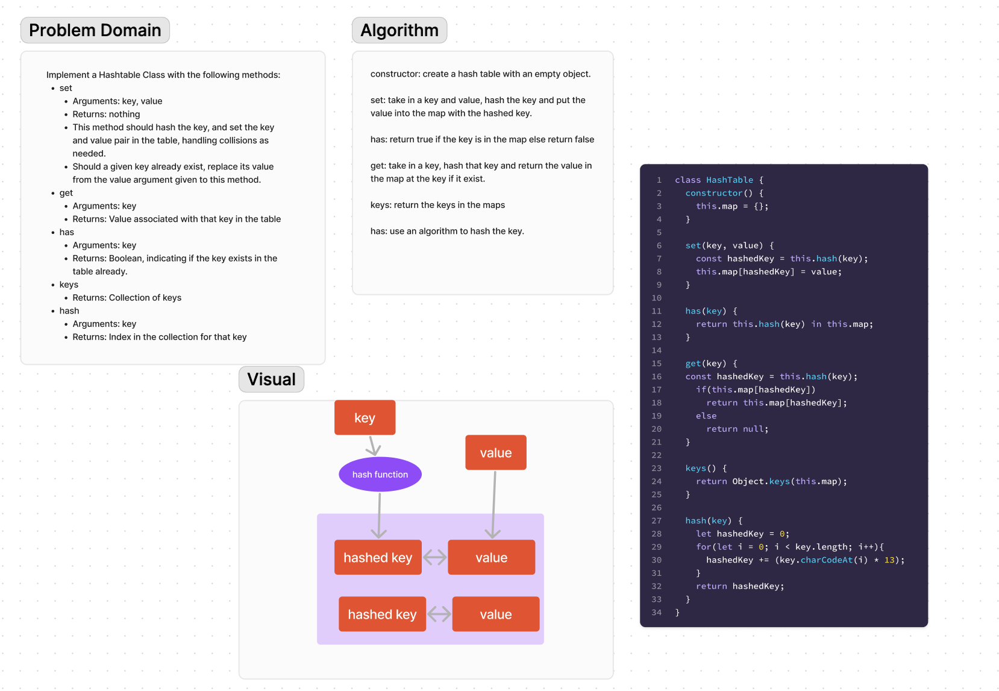

# HashTable
Implement a Hashtable Class

## Whiteboard Process

## Approach & Efficiency
constructor: create a hash table with an empty object.

set: take in a key and value, hash the key and put the value into the map with the hashed key.

has: return true if the key is in the map else return false

get: take in a key, hash that key and return the value in the map at the key if it exist.

keys: return the keys in the maps

has: use an algorithm to hash the key.

## Solution
[Code](HashTable.js)\
[Tests](HashTable.test.js)
