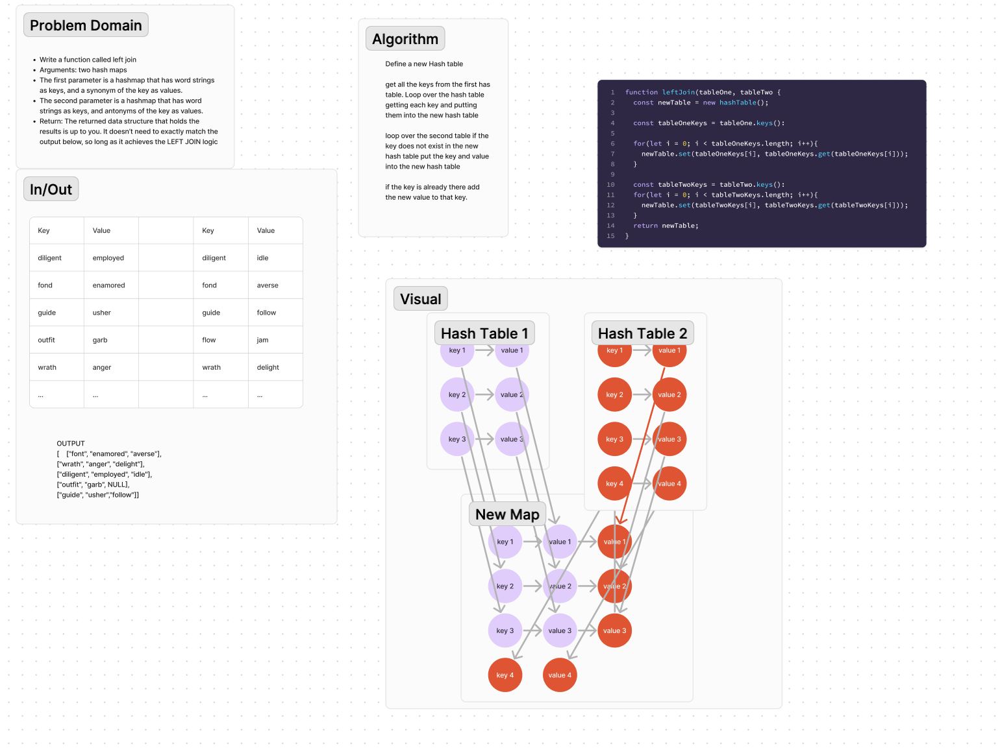

# HashTable
Write a function called left join
Arguments: two hash maps
The first parameter is a hashmap that has word strings as keys, and a synonym of the key as values.
The second parameter is a hashmap that has word strings as keys, and antonyms of the key as values.
Return: The returned data structure that holds the results is up to you. It doesn’t need to exactly match the output below, so long as it achieves the LEFT JOIN logic

## Whiteboard Process

## Approach & Efficiency
Define a new Hash table

get all the keys from the first has table. Loop over the hash table getting each key and putting them into the new hash table

loop over the second table if the key does not exist in the new hash table put the key and value into the new hash table

if the key is already there add the new value to that key.

## Solution
[Code](leftJoin.js)\
[Tests](leftJoin.test.js)
