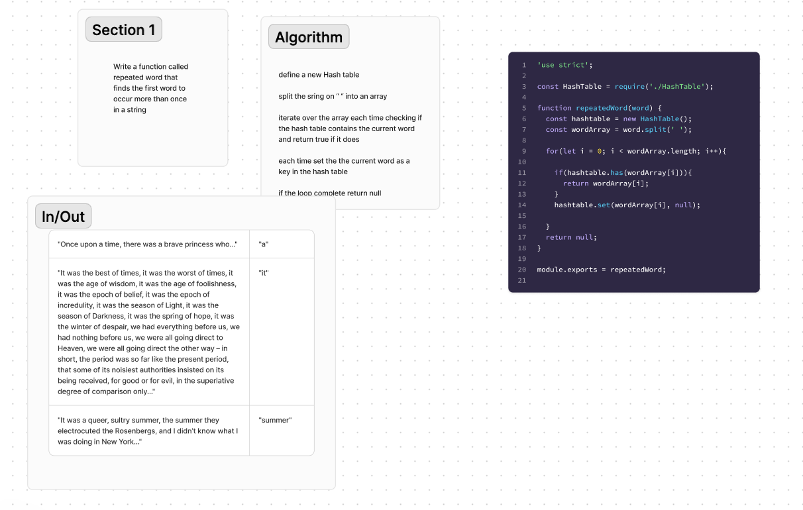

# HashTable
Write a function called repeated word that finds the first word to occur more than once in a string

## Whiteboard Process

## Approach & Efficiency
define a new Hash table

split the sring on “ “ into an array

iterate over the array each time checking if the hash table contains the current word and return true if it does

each time set the the current word as a key in the hash table

if the loop complete return null

## Solution
[Code](repeated-word.js)\
[Tests](repeated-word.test.js)
