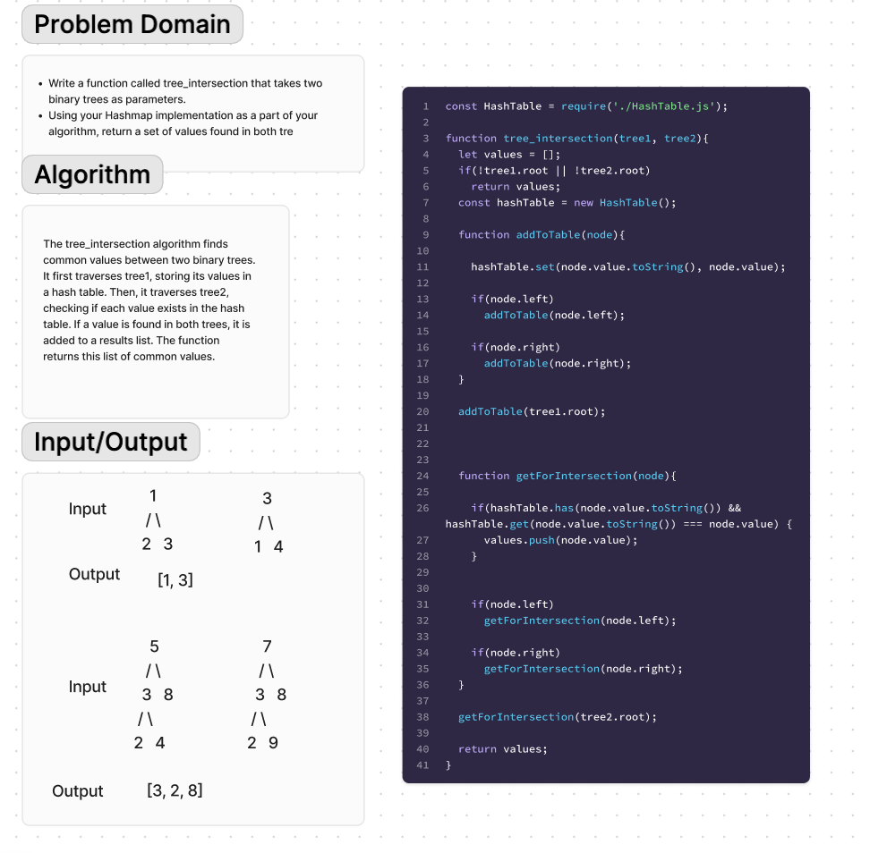

# Tree Intersection
Write a function called tree_intersection that takes two binary trees as parameters.
Using your Hashmap implementation as a part of your algorithm, return a set of values found in both tre

## Whiteboard Process

## Approach & Efficiency
The tree_intersection algorithm finds common values between two binary trees. It first traverses tree1, storing its values in a hash table. Then, it traverses tree2, checking if each value exists in the hash table. If a value is found in both trees, it is added to a results list. The function returns this list of common values.

## Solution
[Code](tree-intersection.js)\
[Tests](tree-intersection.test.js)

## References
chatgpt
