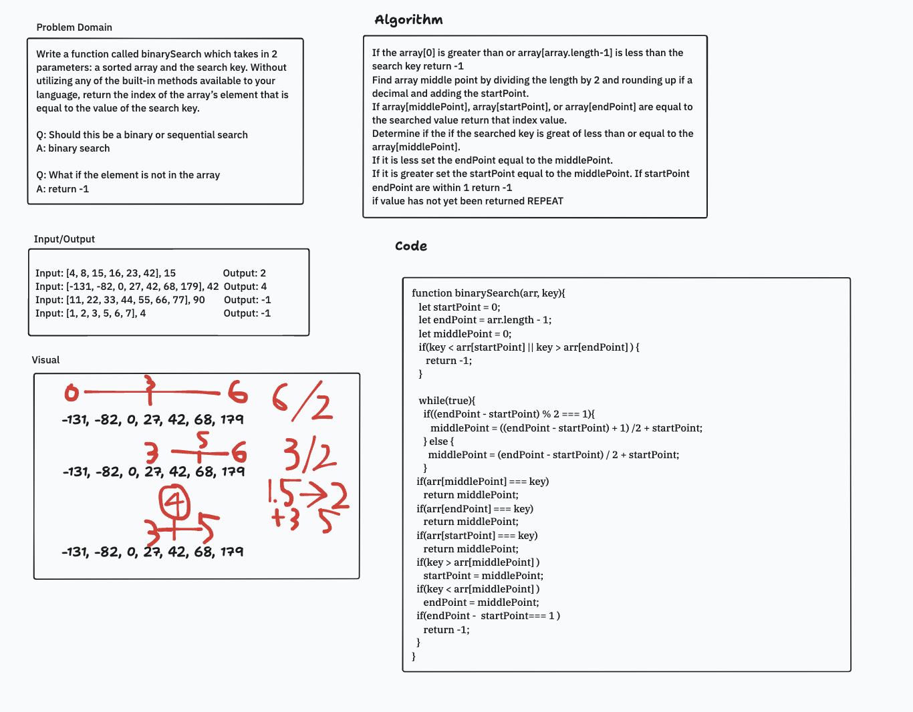

# Array binary shift
Write a function called binarySearch which takes in 2 parameters: a sorted array and the search key. Without utilizing any of the built-in methods available to your language, return the index of the array’s element that is equal to the value of the search key.

## Whiteboard Process

## Approach & Efficiency
We found a the index of a value in a array using a binary switch. The search end point and start point are changed to the middle point depending on which side of the middle the key value is on.
## Solution
